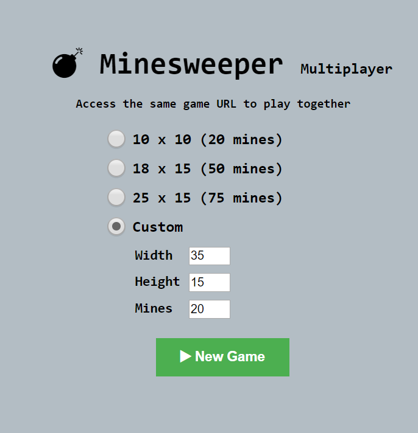
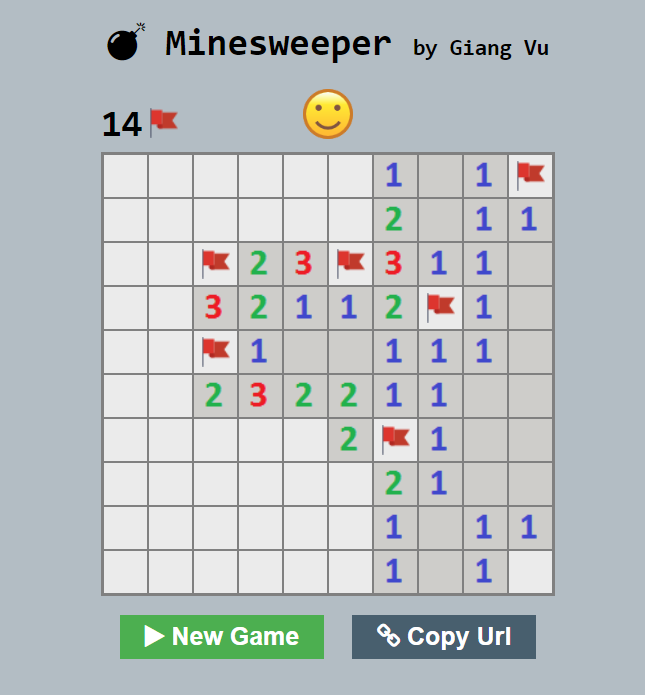
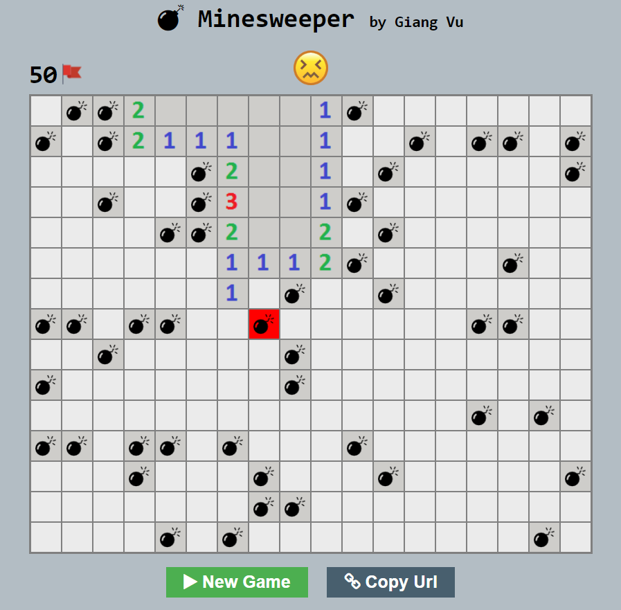

# Minesweeper

## Screenshots

<div>





</div>

## How to set up and run this web application on your computer

### Prerequisites 
* Python and Virtualenv
* MongoDB

#### 1. Clone the source code
```
$ git clone https://github.com/giangvu/Minesweeper.git
```

#### 2. Create and activate virtual environment
On Windows:
```
$ virtualenv venv
$ venv\Scripts\activate.bat
```

On Linux:
```
$ virtualenv venv
$ source venv/bin/activate
```

#### 3. Install libraries
```
$ pip install -r requirements.txt
```

#### 4. Run the application
```
$ python app.py
```

### Notes:
* Make sure that MongoDB listens on the same port as the value of `app.config['MONGO_PORT']` in the `app.py`. By default, this value is `27017`

